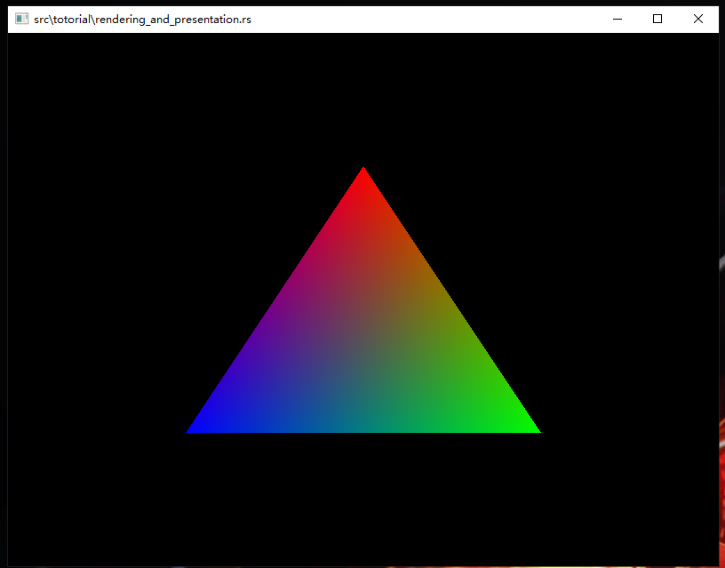

# vulkan 教程

[](LICENSE)

A Rust implementation of the [Vulkan Tutorial](https://vulkan-tutorial.com) based on [ash crate](https://crates.io/crates/ash).

## Status

The environment configuration is same as ash. See [here](https://github.com/MaikKlein/ash#example) for more detail.

Vulkan is quite hard. All examples on official website have been finished. :beers:

## Usage

Run any example with the following command:

```shell
$ cargo run --features=debug 1
```

## Snapshot




